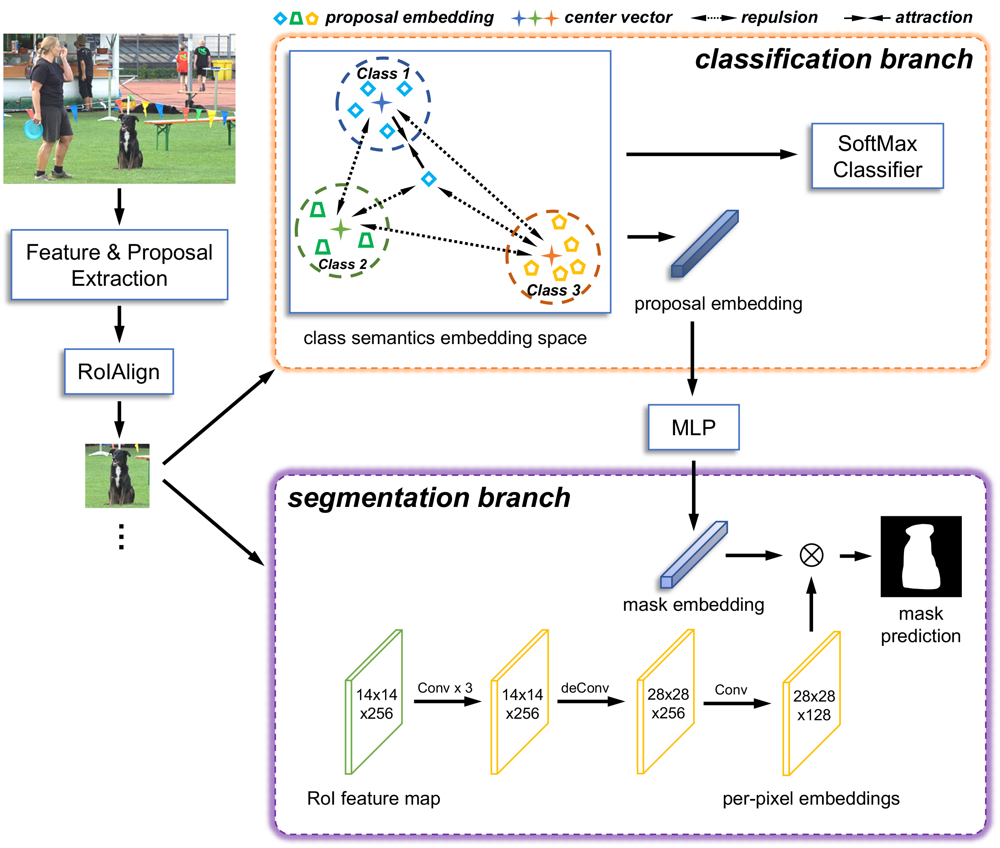

# SemSeg
This repository contains the code for the IEEE Robotics and Automation Letters paper "Class Semantics Modulation for Open-Set Instance Segmentation"

Authors: Yifei Yang, Zhongxiang Zhou, Jun Wu, Yue Wang, Rong Xiong

[Paper](https://ieeexplore.ieee.org/document/10388394) | [Project Page](https://yifei-y.github.io/project-pages/SemSeg/)

## Abstract

This letter addresses the challenge of open-set instance segmentation (OSIS) which segments both known objects and unknown objects not seen in training, and thus is essential for enabling robots to safely work in the real world. Existing solutions adopt class-agnostic segmentation where all classes share the same mask output layer leading to inferior performance. Motivated by the superiority of the class-specific mask prediction in close-set instance segmentation, we propose SemSeg with class semantics extraction and mask prediction modulation for conducting class-specific segmentation in OSIS. To extract class semantics for both known and unknown objects in the absence of supervision on unknown objects, we use contrastive learning to construct an embedding space where objects from each known class cluster in an independent territory and the complementary region of known classes can accommodate unknown objects. To modulate the mask prediction, we convert class semantic embedding to convolutional parameters used to predict the mask. Class semantics modulated OSIS allows optimizing the mask output layer for each class independently without competition between each other. And class semantic information is engaged in the segmentation process directly so that can guide and facilitate the segmentation task, which benefits unknown objects with severe generalization challenges particularly. Experiments on the COCO and GraspNet-1Billion datasets demonstrate the merits of our proposed method, especially the strength of instance segmentation for unknown objects.

## Model



## Installation

```bash
conda create -n semseg python=3.8
conda activate semseg

conda install pytorch==1.10.0 torchvision==0.11.0 torchaudio==0.10.0 cudatoolkit=11.3 -c pytorch -c conda-forge

python -m pip install detectron2 -f https://dl.fbaipublicfiles.com/detectron2/wheels/cu113/torch1.10/index.html

pip uninstall setuptools
pip install setuptools==59.5.0
```

## Data

### COCO

Download [COCO](https://cocodataset.org/#download) 2017 train/val images and annotations. Then organize dataset as the following structure.

```
datasets/
  coco/
    annotations/
      instances_{train,val}2017.json
    {train,val}2017/
      # image files that are mentioned in the corresponding json
```

### GraspNet

Download train and test images of [GraspNet-1Billion](https://graspnet.net/datasets.html). Unzip and put them under datasets/graspnet. Download [annotation files](https://drive.google.com/drive/folders/1mT_MIhleHzEQHJprN2Y_K8gVrF5A79w9?usp=share_link) and put under datasets/graspnet_os/annotations. Then run script to organize the images:

```bash
bash datasets/graspnet_os_utils/prepare_graspnet_os.sh
```

Expected dataset structure:

```
graspnet_os\
  annotations\
    graspnet_os_train.json
    graspnet_os_test_{1,2,3,4,5,6}.json
  images\
    000001.png
    000002.png
    000003.png
    000004.png
    ...
```

## Train and Test

### Train

- COCO

```sh
python train.py \
--config-file configs/COCO/semseg_R50_FPN_128k.yaml \
OUTPUT_DIR output_dir
```

- GraspNet

```sh
python train.py \
--config-file configs/GraspNet/semseg_R50_FPN_128k.yaml \
OUTPUT_DIR output_dir
```

### Test

- COCO

```sh
python train.py \
--config-file configs/COCO/semseg_R50_FPN_128k.yaml \
--eval-only \
MODEL.WEIGHTS path/to/checkpoint \
OUTPUT_DIR output_dir
```

- GraspNet

```sh
python train.py \
--config-file configs/GraspNet/semseg_R50_FPN_128k.yaml \
--eval-only \
MODEL.WEIGHTS path/to/checkpoint \
OUTPUT_DIR output_dir
```

## Model Zoo

### VOC-COCO Benchmark

| Model  | AOSE  | $\text{AP}_\text{k}$ | $\text{AR}_\text{unk}^{10}$ | $\text{AR}_\text{unk}^{30}$ | $\text{AR}_\text{unk}^{100}$ | config & checkpoint |
| :----- | :---: | :---: | :---: | :---: | :---: | :---: | 
| SemSeg | 2789  | 30.3 | 12.2 | 17.2 | 19.3 | [config](configs/COCO/semseg_R50_FPN_128k.yaml) [model](https://drive.google.com/file/d/10o0Dcju0jIZHTGi2FskpT_Jj3710TMMg/view?usp=share_link) |

### GraspNet Benchmark

| Model  |  AOSE  | $\text{AP}_\text{k}$ | $\text{AP}_\text{unk}$ | config & checkpoint |
| :----- | :---: | :---: | :---: | :---: |
| SemSeg | 18337 | 63.8 | 38.7 | [config](configs/GraspNet/semseg_R50_FPN_128k.yaml) [model](https://drive.google.com/file/d/1-29LLXgOKS6xuIM95K52ahwMQzfmNHud/view?usp=sharing) |

## Citation

If you find our code or paper useful, please cite as

```bibtex
@ARTICLE{SemSeg,
  author={Yang, Yifei and Zhou, ZhongXiang and Wu, Jun and Wang, Yue and Xiong, Rong},
  journal={IEEE Robotics and Automation Letters}, 
  title={Class Semantics Modulation for Open-Set Instance Segmentation}, 
  year={2024},
  volume={9},
  number={3},
  pages={2240-2247},
  doi={10.1109/LRA.2024.3353170}
}
```